# 📊 BookMind Database Schema

## Core Entity Relationships

```mermaid
erDiagram
    USERS {
        bigint id PK
        string uuid UK "App unique identifier"
        string email UK "Login email"
        string name "Display name"
        string password_digest "Encrypted password"
        boolean email_verified "Email confirmation"
        datetime last_login_at "Activity tracking"
        string account_status "active/suspended/deleted"
        datetime created_at
        datetime updated_at
    }

    USER_DEVICES {
        bigint id PK
        bigint user_id FK
        string device_token "FCM/APNS token"
        string device_type "ios/android"
        string device_name "iPhone 15, Samsung Galaxy"
        boolean active "Current device status"
        datetime last_used_at
        datetime created_at
        datetime updated_at
    }

    USER_PREFERENCES {
        bigint id PK
        bigint user_id FK
        json reading_settings "font_size, theme, tts_voice"
        json notification_settings "reminders, achievements"
        string timezone "User timezone"
        integer daily_reading_goal "Minutes per day"
        string preferred_reading_time "morning/afternoon/evening"
        datetime created_at
        datetime updated_at
    }

    USER_READING_STATS {
        bigint id PK
        bigint user_id FK
        integer reading_streak "Consecutive days"
        integer total_books_read "Completed books"
        integer total_reading_time "Minutes read"
        integer pages_read_today "Daily progress"
        date last_reading_date "Streak tracking"
        datetime created_at
        datetime updated_at
    }

    BOOKS {
        bigint id PK
        bigint user_id FK
        string uuid UK "Book sharing identifier"
        string title "Book title"
        string author "Book author"
        string isbn "ISBN if available"
        string file_path "Storage location"
        string file_type "pdf/epub/txt"
        bigint file_size "File size in bytes"
        text content_text "Extracted text content"
        string processing_status "pending/processing/completed/failed"
        json metadata "page_count, language, etc"
        datetime uploaded_at
        datetime processed_at
        datetime created_at
        datetime updated_at
    }

    READING_PROGRESS {
        bigint id PK
        bigint book_id FK
        bigint user_id FK
        integer current_page "Current reading position"
        integer total_pages "Total book pages"
        decimal progress_percentage "0.0 to 100.0"
        text current_chapter "Chapter name/number"
        integer reading_position "Character/word position"
        decimal reading_speed "Words per minute"
        datetime last_read_at "Last reading session"
        datetime started_reading_at "First time opened"
        datetime completed_at "Book completion"
        datetime created_at
        datetime updated_at
    }

    HIGHLIGHTS {
        bigint id PK
        bigint book_id FK
        bigint user_id FK
        string uuid UK "Highlight sharing ID"
        integer start_position "Text start position"
        integer end_position "Text end position"
        text highlighted_text "Selected text"
        string color "highlight_color"
        text note "User annotation"
        integer page_number "Page location"
        boolean is_favorite "Star highlight"
        datetime created_at
        datetime updated_at
    }

    BOOKMARKS {
        bigint id PK
        bigint book_id FK
        bigint user_id FK
        integer page_number "Bookmarked page"
        integer position "Position on page"
        string title "Bookmark name"
        text note "Bookmark description"
        datetime created_at
        datetime updated_at
    }

    QUOTES {
        bigint id PK
        bigint book_id FK
        bigint user_id FK
        bigint highlight_id FK "Source highlight"
        string uuid UK "Quote sharing ID"
        text quote_text "Quote content"
        text context "Surrounding context"
        string background_template "Design template"
        json style_settings "colors, fonts, layout"
        json social_media_data "platform_specific_formats"
        integer share_count "Times shared"
        datetime shared_at "First share time"
        datetime created_at
        datetime updated_at
    }

    CHAT_SESSIONS {
        bigint id PK
        bigint book_id FK
        bigint user_id FK
        string uuid UK "Session sharing ID"
        string title "Chat session name"
        string status "active/archived"
        integer message_count "Number of messages"
        datetime last_message_at "Recent activity"
        datetime created_at
        datetime updated_at
    }

    CHAT_MESSAGES {
        bigint id PK
        bigint chat_session_id FK
        string role "user/assistant/system"
        text content "Message content"
        json metadata "tokens, model_used, context"
        text context_reference "Book section referenced"
        datetime created_at
        datetime updated_at
    }

    EMBEDDINGS {
        bigint id PK
        bigint book_id FK
        string chunk_id UK "Unique chunk identifier"
        text content "Text chunk"
        integer chunk_index "Order in book"
        integer start_position "Text start"
        integer end_position "Text end"
        vector embedding "Vector embedding"
        json metadata "page, chapter, etc"
        datetime created_at
        datetime updated_at
    }

    %% Relationships
    USERS ||--o{ USER_DEVICES : "has many"
    USERS ||--|| USER_PREFERENCES : "has one"
    USERS ||--|| USER_READING_STATS : "has one"
    USERS ||--o{ BOOKS : "uploads"
    USERS ||--o{ READING_PROGRESS : "tracks"
    USERS ||--o{ HIGHLIGHTS : "creates"
    USERS ||--o{ BOOKMARKS : "saves"
    USERS ||--o{ QUOTES : "generates"
    USERS ||--o{ CHAT_SESSIONS : "initiates"

    BOOKS ||--o{ READING_PROGRESS : "has progress"
    BOOKS ||--o{ HIGHLIGHTS : "contains"
    BOOKS ||--o{ BOOKMARKS : "has bookmarks"
    BOOKS ||--o{ QUOTES : "source of"
    BOOKS ||--o{ CHAT_SESSIONS : "discussed in"
    BOOKS ||--o{ EMBEDDINGS : "broken into"

    HIGHLIGHTS ||--o{ QUOTES : "source of"
    CHAT_SESSIONS ||--o{ CHAT_MESSAGES : "contains"
```

## 🔑 Key Design Decisions

### **Primary Keys & UUIDs**
- All tables use `bigint` auto-increment PKs for performance
- Public-facing entities have `uuid` columns for sharing/API calls
- UUIDs prevent enumeration attacks and enable easy sharing

### **User Management**
- Separate `user_devices` for multi-device push notifications
- `user_preferences` isolated for frequent updates
- `user_reading_stats` for gamification without bloating core user data

### **Book Processing**
- `processing_status` tracks file upload → text extraction → embedding creation
- `metadata` JSON stores flexible book information
- `content_text` stores extracted text for searching/AI processing

### **Reading Experience**
- `reading_progress` tracks position, speed, and completion
- `highlights` and `bookmarks` are separate for different UX patterns
- `quotes` reference highlights but store independent styling

### **AI Integration**
- `chat_sessions` group conversations by book
- `chat_messages` store full conversation history
- `embeddings` store vector chunks for RAG (Retrieval Augmented Generation)

### **Performance Considerations**
- Indexes on `user_id`, `book_id`, foreign keys
- UUIDs indexed for sharing lookups
- JSON columns for flexible data without schema changes
- Vector column for semantic search (Pinecone alternative)

## 📱 Mobile App Benefits

### **Offline Support**
- User preferences cached locally
- Reading progress synced when online
- Highlights/bookmarks work offline

### **Real-time Sync**
- WebSocket updates for multi-device reading
- Shared quotes with live social features
- Chat sessions synced across devices

### **Push Notifications**
- Multiple device tokens per user
- Reading reminder scheduling
- Achievement notifications

## 🚀 Visualization Tools

To visualize this schema:

1. **Mermaid** (GitHub/Markdown): Copy the diagram above
2. **dbdiagram.io**: Import schema as PostgreSQL
3. **Lucidchart**: Create ERD from SQL export
4. **DrawSQL**: Visual database designer

Would you like me to:
1. Generate the actual Rails migrations for this schema?
2. Export to a specific visualization format?
3. Add any missing tables or relationships?